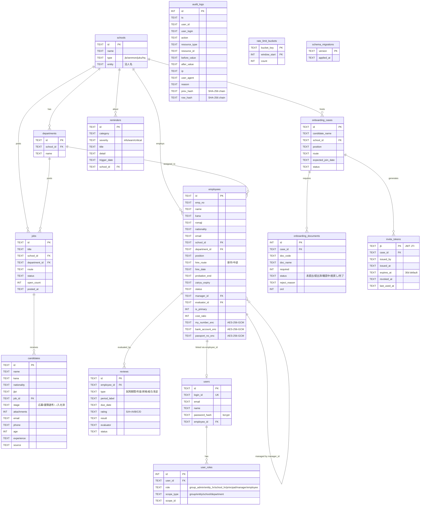
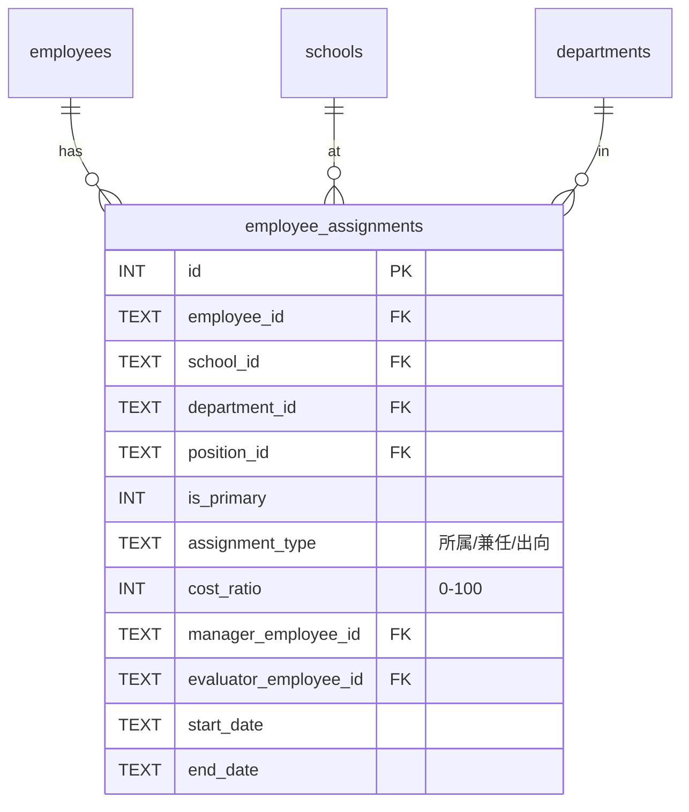

# データベース ER 図

## 全体構成

## 主要な制約・特徴

### 兼任サポート（Multi-assignment）
`employees` テーブルは現状、主所属の１レコードのみ持つシンプルな構造。本番運用で完全な兼任を扱う場合、`employee_assignments` 中間テーブルへの分離を推奨：

### PII 暗号化
- `employees.my_number_enc` / `bank_account_enc` / `passport_no_enc`：すべて **AES-256-GCM** 暗号化
- 形式：`base64url(IV).base64url(authTag).base64url(ciphertext)`
- 鍵導出：`scrypt(ENCRYPTION_KEY, "hr-os-pii-v1", 32)`
- 平文は DB に残さない

### 監査ログのハッシュチェーン
- `audit_logs.prev_hash` + `row_hash` で改ざん検出
- `row_hash = SHA-256(行内容 + 前行の row_hash)`
- SQLiteトリガー `audit_logs_no_update` / `audit_logs_no_delete` が物理的に UPDATE/DELETE を阻止
- 整合性検証 UI：`/settings/audit/verify`

### スコープ管理（RBAC）
- `user_roles.scope_type`：`group` / `entity` / `school` / `department`
- 1ユーザーが複数ロール × 複数スコープを持てる
  - 例：「校長 @ s1」+「部門長 @ d1」
- フィルタは `lib/permissions.ts` で実装

### マイグレーション
- すべてのスキーマ変更は `migrations/NNN_*.sql` に集約
- 適用済みバージョンは `schema_migrations` で追跡
- 起動時に未適用のものをトランザクション内で順次適用
